<div align="center">
  
  <h1>Hola, soy Jose Andres Sabogal Vega 👨🏻‍💻</h1>
  <h3>🚀 Senior Frontend Engineer | Building Scalable Web Experiences</h3>
</div>

<p align="center">
  <strong>Transformando problemas complejos en interfaces intuitivas, escalables y de alto rendimiento.</strong> 🌟
</p>

<p align="center">
  Especialista en desarrollo frontend con un enfoque profundo en <em>Arquitectura de Software</em>, <em>Design Systems</em> y <em>Micro-frontends</em>.
  <br />
  Me considero un aliado estratégico en el ciclo de desarrollo: voy más allá de escribir código para construir bases sólidas que permiten a los equipos iterar rápido sin sacrificar la calidad.
  <br />
  <br />
  <em>"Siempre aprendiendo, siempre creando."</em> 🚀
</p>

```javascript
const JavsDev = {
  role: "Senior Frontend Engineer 👨‍💻",
  passion: [
    "Building Scalable Web Apps",
    "UX/UI Architecture",
    "Mobile Development",
  ],
  specialties: {
    core: ["React", "TypeScript", "Next.js"],
    architecture: ["Micro-frontends", "Design Systems", "Clean Architecture"],
  },
  contact: {
    email: "jasabogal@utp.edu.co",
    social: {
      linkedin: "https://www.linkedin.com/in/jasabogal/",
      github: "https://github.com/jasvdev",
    },
  },
  status: "Ready for new challenges! 🚀",
};
```

## 💎 Experiencia

A lo largo de mi carrera, he aportado valor en diversos ecosistemas de negocio: desde ERPs empresariales y startups, hasta marketplaces, pasarelas de pago y plataformas SaaS. Disfruto colaborar estrechamente con equipos multidisciplinarios para alinear los retos técnicos con los objetivos del producto.

Trabajo en entornos ágiles bajo la primicia de que el **clean code**, la **experiencia de usuario (UX)** y el **rendimiento** no son opcionales, sino el pilar de un buen producto. Siempre estoy explorando nuevas herramientas y paradigmas para crecer al ritmo de la web 🌐.

## 🛠️ Tech Skills

<p align="left">
  
  
  
  
  
  
  
  
  
  
  
  
  
  
  
  
  
  
  
  
  
  
  
  
  
  
  
  
  
  
  
  
  
  
  
  
  
  
  
  
  
</p>

## 📜 Certificaciones

### DevTalles
<p align="left">
  
</p>

### Microsoft
<p align="left">
  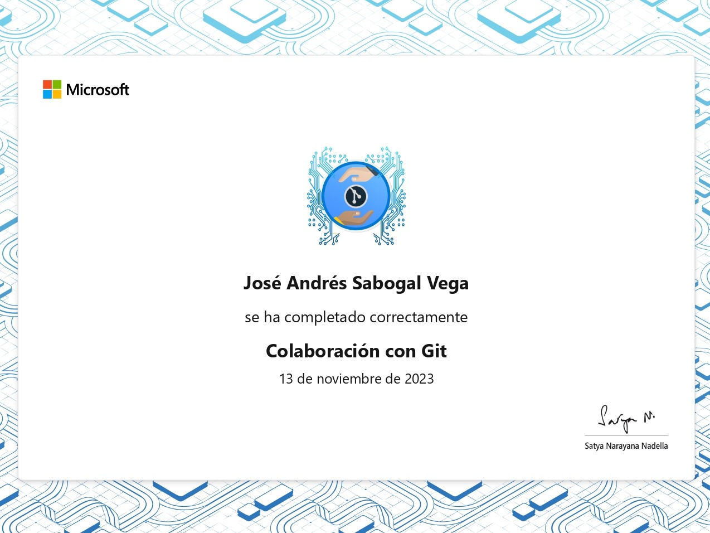
  
  
  
  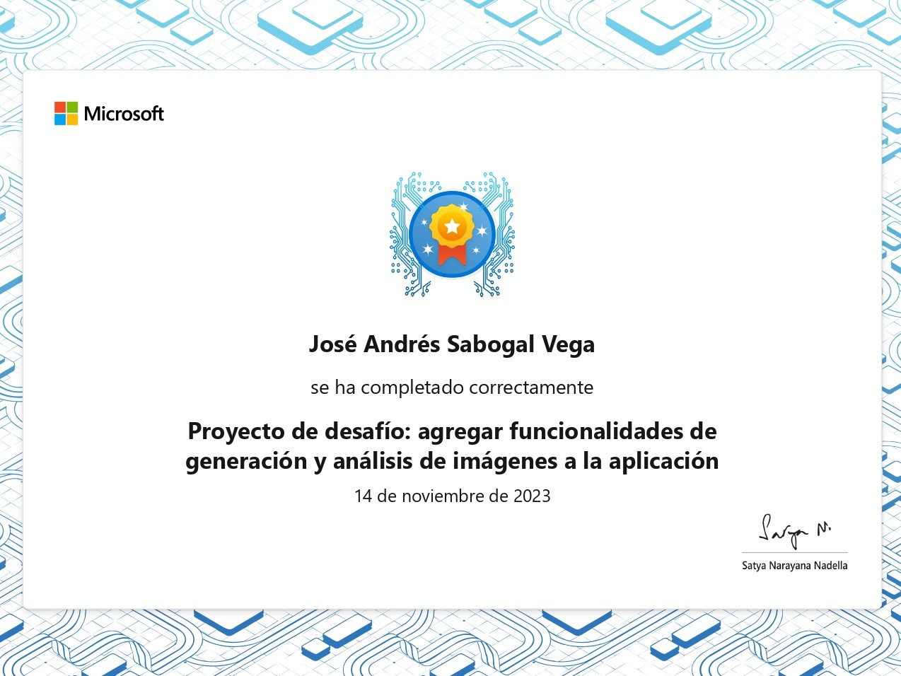
  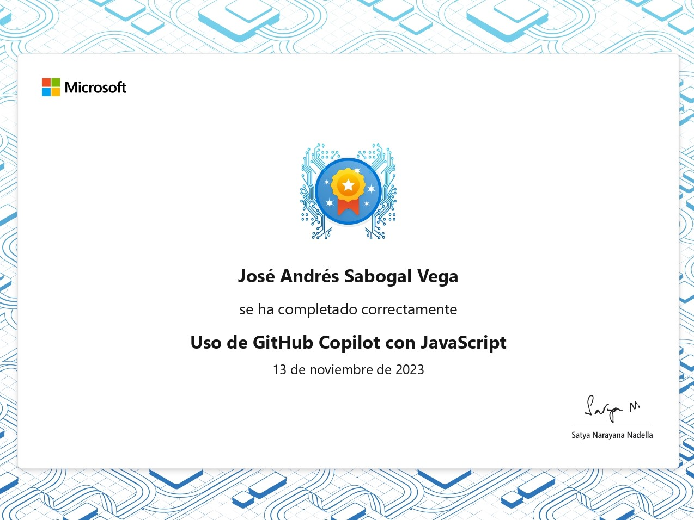
  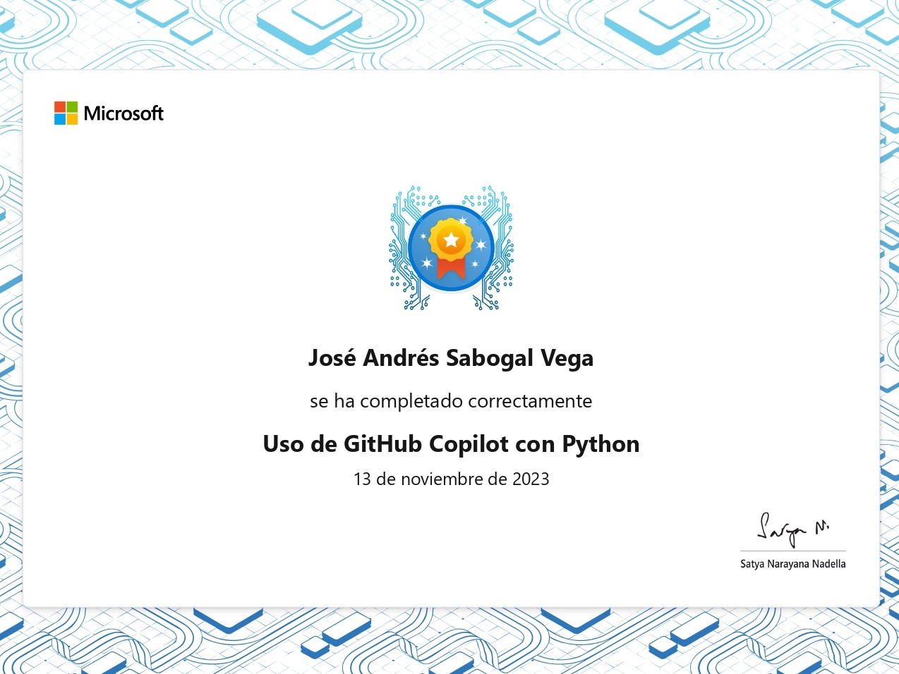
  
  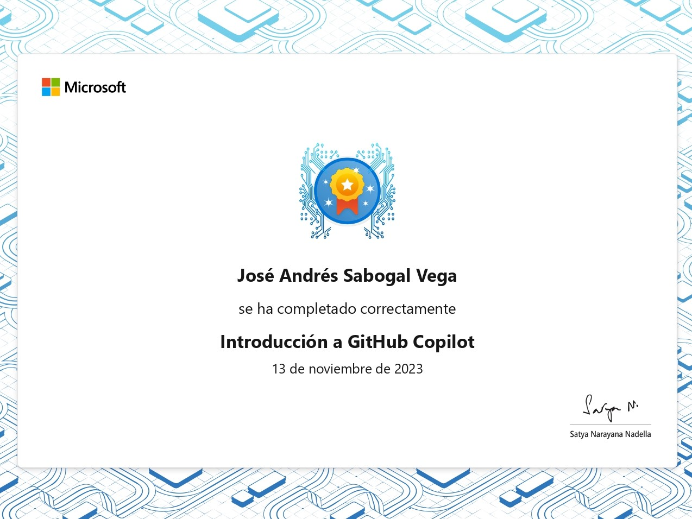
  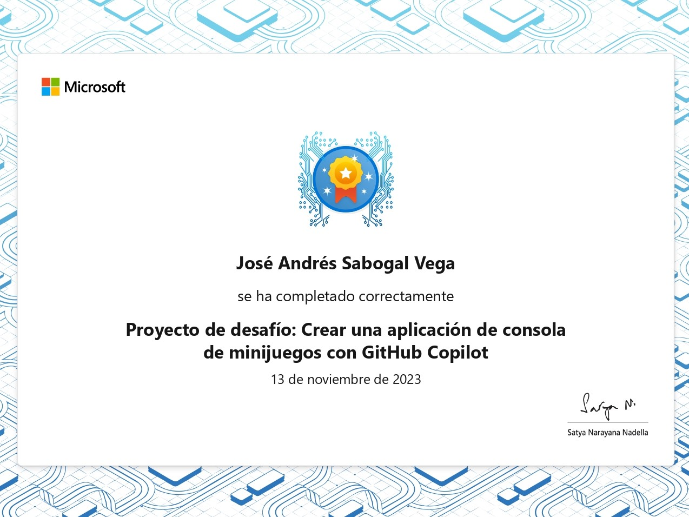
</p>

### Platzy
<p align="left">
  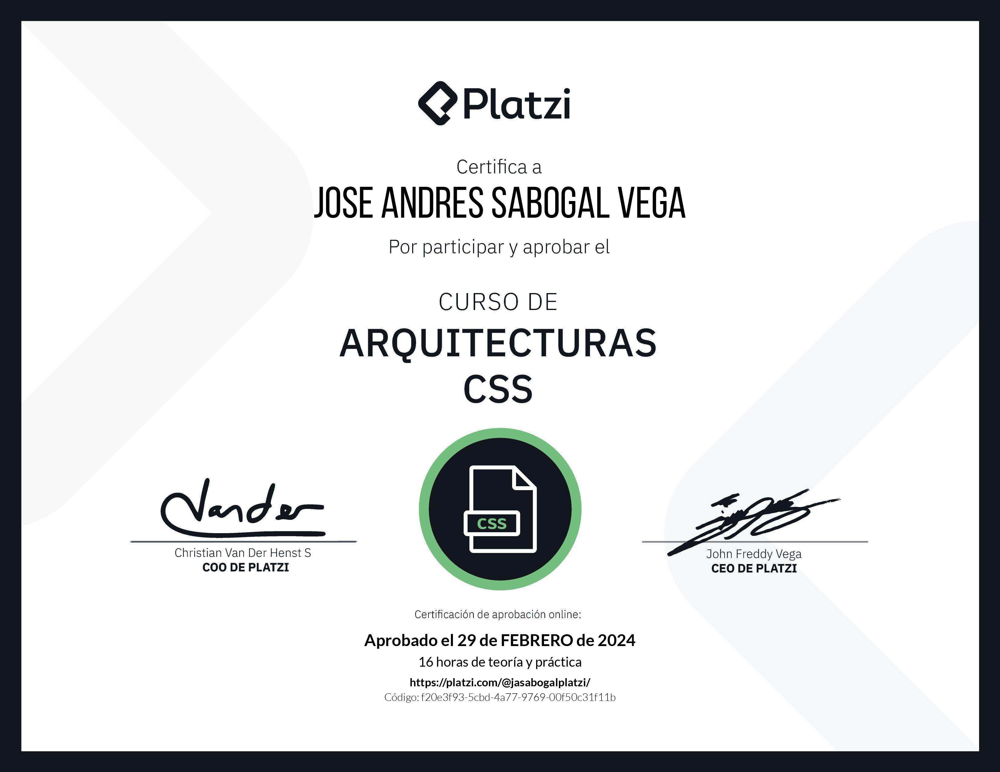
  
  
  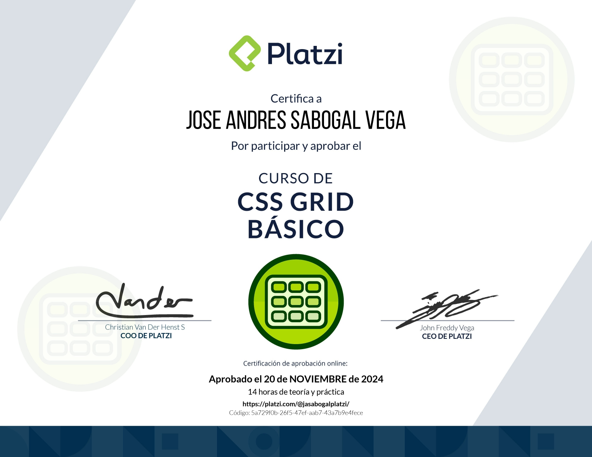
  
  
  
  
  
  
  
  
  
  
  
  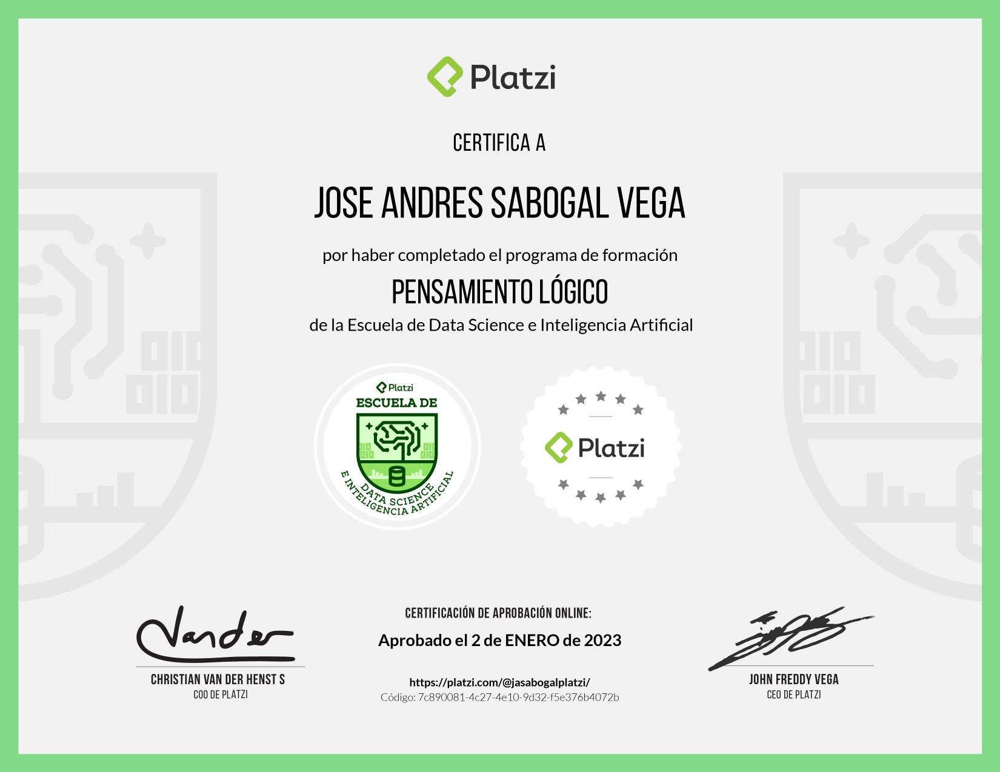
  
  
  
  
  
  
  
  
  
  
  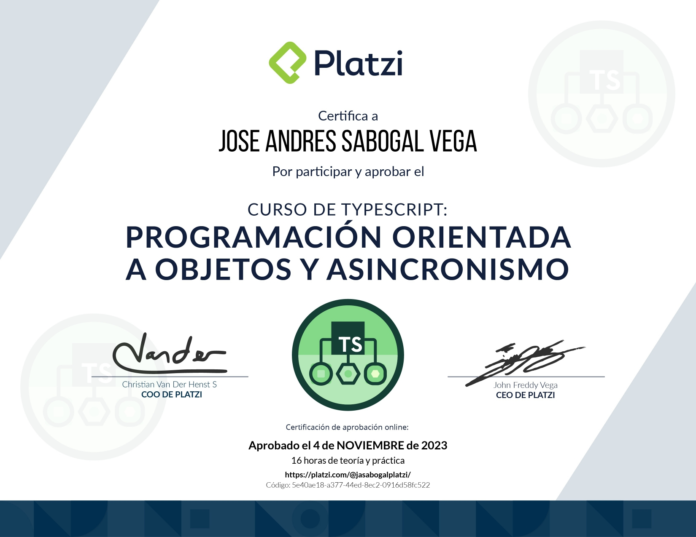
  
  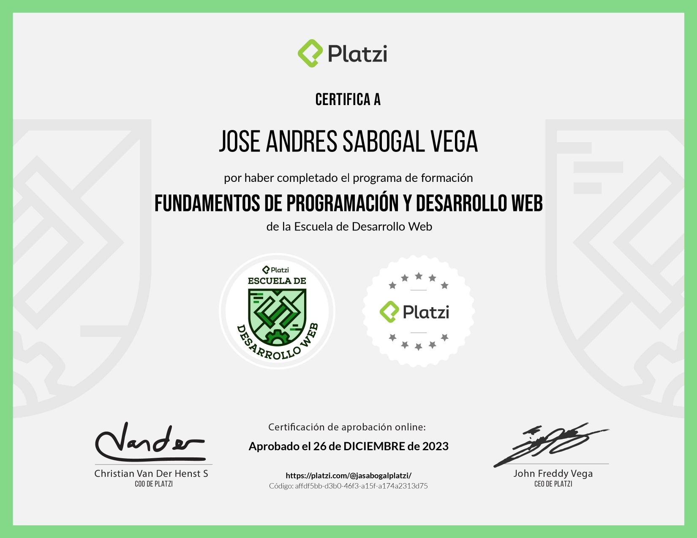
  
</p>

### Udemy
<p align="left">
  
  
  
  
  
  
  
  
</p>

## 📊 GitHub Stats

<div align="center">
  
</div>
